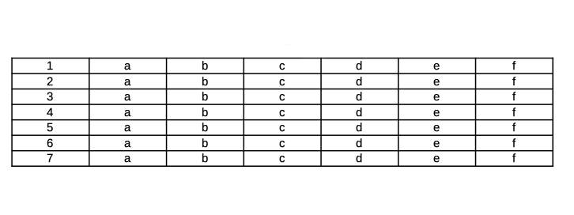

# OCR
Python OpenCV Tesseract OCR
Автоматическое выравнивание:  
  
Определение контуров и сегментирование на ячейки:  
  
Разделение на отдельные линии:  

  
---
##Задачи:
1. [Автоматическое выравнивание страницы по тексту](https://www.pyimagesearch.com/2017/02/20/text-skew-correction-opencv-python/)
   * Обнаружение блока текста на изображении.
   * Вычисление угла повернутого текста.
   * Поворот изображения для коррекции перекоса.
2. Определение контуров таблицы
3. Вырезка необходимой строки 
4. Размытие всех данных на листе
5. Наложение вырезанной линии на размытое изображение

Материалы:  
https://stackoverflow.com/questions/51699779/how-to-find-rotate-and-crop-a-section-of-text-in-opencv-python  
https://stackoverflow.com/questions/9413216/simple-digit-recognition-ocr-in-opencv-python   
